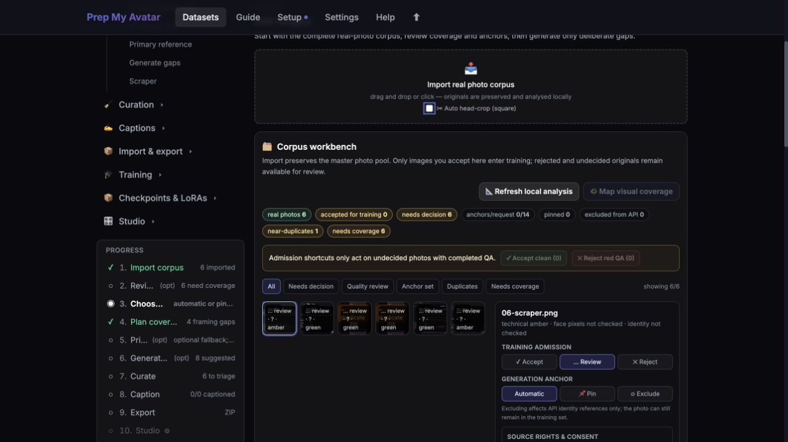
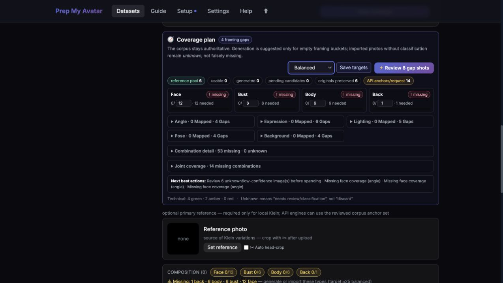
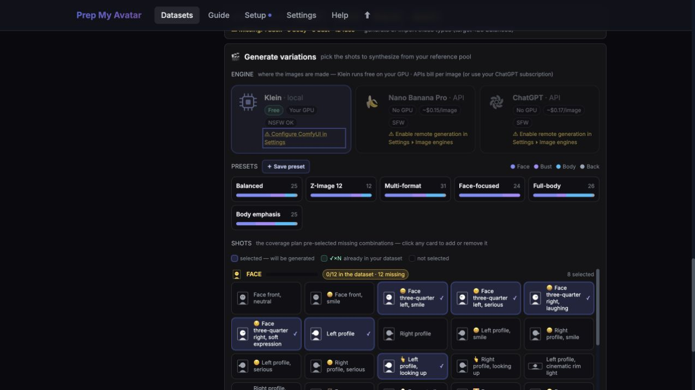
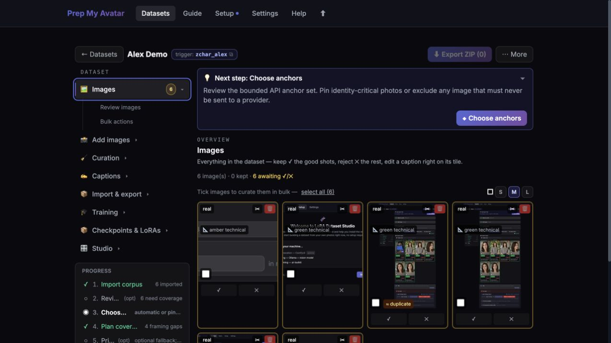
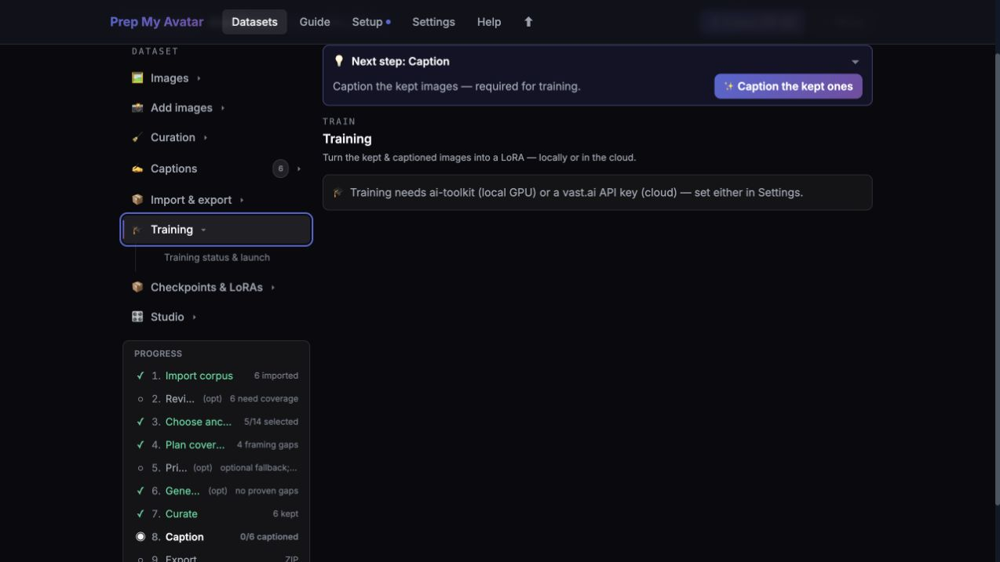
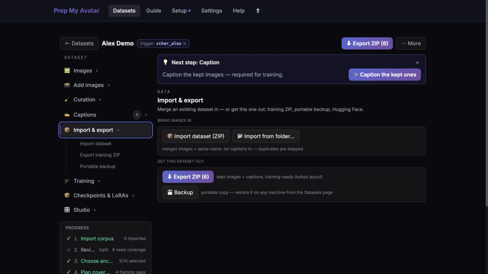

# Prep My Avatar

Personal, noncommercial fork of [LoRA Dataset Studio](https://github.com/perfectgf/lora-dataset-studio),
focused on preparing a large, imperfect photo corpus before using generation
to fill specific coverage gaps.

The upstream application provides the guided workspace, curation, captioning,
training, export, setup, and documentation foundation. This fork changes the
front of the journey:

```text
large photo corpus → analyse → plan coverage → generate missing combinations → review → train/export
```

## Workflow at a glance

### 1. Import and review the source corpus

Import preserves every original while the Corpus Workbench surfaces technical
quality, duplicates, training admission, anchor choices, rights, and coverage.



### 2. Plan coverage

See which framing and visual combinations are covered, weak, unknown, or missing
before spending anything on generation.



### 3. Generate only proven gaps

Choose a local or API engine, then review the preselected shots that fill genuine
coverage gaps.



### 4. Curate the combined dataset

Keep or reject imported and generated candidates together, with quality and
provenance visible during review.



### 5. Check training readiness

The training workspace keeps the next blocker visible and shows whether a local
or cloud trainer is configured before launch.



### 6. Export or back up

Export ordinary training pairs, or create a portable backup that retains the
full preparation history.



## Fork-specific workflow

- Import a large real-photo corpus while preserving every uploaded original byte,
  filename, SHA-256 digest, and normalized training derivative.
- Refresh technical quality locally and retain near-duplicates in explicit review
  groups; only byte-identical reimports are skipped.
- Keep character imports in a preserved master corpus until an explicit training
  admission decision; face-aware QA measures the subject crop, multiple faces and
  identity against a reviewed multi-reference centroid.
- Map framing, angle, expression, lighting, pose, background, and occlusion with
  the optional local vision model or the manual Corpus Workbench editor.
- Separate the complete private reference pool from a bounded API anchor pack.
  Pin identity-critical images, leave selection automatic, or exclude an image
  from providers without removing it from training.
- Show covered, weak, missing, and unknown states. Unknown evidence never becomes
  an excuse for an API call.
- Preselect only proven catalogue gaps for Nano Banana or ChatGPT. Local Klein
  remains available when a primary reference is set.
- Keep imported and generated candidates together for curation while preserving
  engine, prompt, gap, anchor, source, and derivation provenance.
- Treat low-quality repair as generative reconstruction: use the exact preserved
  upload, compare automatic quality/identity deltas, and admit either the source or
  its reconstruction — never both.
- Warn before training about red/amber pixels, identity risk, watermarks, enlarged
  crops, unresolved derivations and an overly synthetic source mix.
- Export ordinary image/text training pairs plus a model-neutral JSON manifest;
  portable backups retain originals, analysis, anchor decisions, coverage, and
  provenance.
- Freeze every admitted training run into an immutable, hashed snapshot and
  link fixed-seed Studio evidence back to that exact launch record.
- Keep destructive work recoverable through curation undo, app-wide Trash and
  validated portable-backup restore; provide a read-only database/filesystem
  integrity report in Settings.

The full corpus stays local. Only the visible bounded anchor pack is sent to an
API generation engine; images marked **Exclude** never enter that pack.

## Current application base

The forked application lives in the upstream layout:

- `backend/` — Flask application and dataset services
- `frontend/` — React workspace and guided UI
- `docs/guide/` — getting started, usage, troubleshooting, and help
- `docs/DATASET_GUIDE.md` — dataset-quality guidance
- `src/avatar_prep/` — the original prototype analysis library being migrated into the fork

See [`docs/specs/import-first-multi-reference-design.md`](docs/specs/import-first-multi-reference-design.md)
for the fork-specific architecture and data contracts.

## Process and health model

Run the application through `python backend/run.py` (or the bundled launcher).
One server process owns a data directory at a time: the launcher enforces this
with `data/server.lock` because the schedulers, provider monitors, and SQLite job
dispatcher are intentionally in-process. Multi-worker WSGI deployment is not
supported; scale expensive image work through the existing external engines and
durable queue instead of starting additional web workers.

`GET /api/health/live` reports process liveness. `GET /api/health/ready` also
checks the database schema, writable data storage, and committed frontend build;
launchers and container probes should use the readiness endpoint. The legacy
`GET /api/health` remains available for compatibility.

Git-checkout updates are fast-forward-only transactions: a private journal is
written before code changes, dependency and isolated-startup/frontend gates run
before restart, and failures restore the previous revision without overwriting
local edits. Remote generation is disabled by default, and non-loopback access
is protected by a login token unless the operator explicitly opts out.

## Exposing the app beyond localhost

The default `127.0.0.1` bind is intentionally local-only. If you enable LAN
access or bind `LDS_HOST=0.0.0.0`, keep **Require access token** enabled and use
the `/remote-login` form from the other device. Put `LDS_ACCESS_TOKEN` in the
environment (Docker users set it in `.env`) or let the desktop app create and
persist a token. Tokens belong in the login form or an `Authorization: Bearer`
header—never in a URL or QR-code query string.

Only disable the token on a network you deliberately trust or behind an
authenticated VPN/reverse proxy. This is a single-user application with access
to local datasets, API keys, generation engines, and paid cloud training; it is
not designed as a public multi-user service.

## Legal and responsible use

Use images you own, license, or have permission to process. Record the source
basis and identifiable-person consent in the Corpus Workbench before training;
the preflight reports missing rights metadata. Publishing additionally requires
an explicit confirmation that you have the right and consent to share the
selected material.

Remote generation is opt-in because it sends the displayed bounded anchor pack
and prompt to the selected provider. Review that provider's terms and the rights
of every identifiable person before enabling it. Images excluded from provider
anchors stay local, and local Klein generation remains available without this
consent toggle.

## Versioning

The current application release is **2026.07.21.1**. Application releases use
calendar versions in the form `YYYY.MM.DD.N`, with matching Git tags such as
`v2026.07.21.1`; `N` increments when more than one release is cut on the same day.

`backend/app/version.py` is the application version source of truth. The prototype
`avatar_prep` Python package keeps its independent SemVer, and the frontend package
version is internal build metadata rather than the application release number. See
[`docs/VERSIONING.md`](docs/VERSIONING.md) for the complete policy and release steps.

## License and attribution

This is a personal, noncommercial project. See [`NOTICE.md`](NOTICE.md) and
[`LICENSE`](LICENSE) for attribution and license terms.
